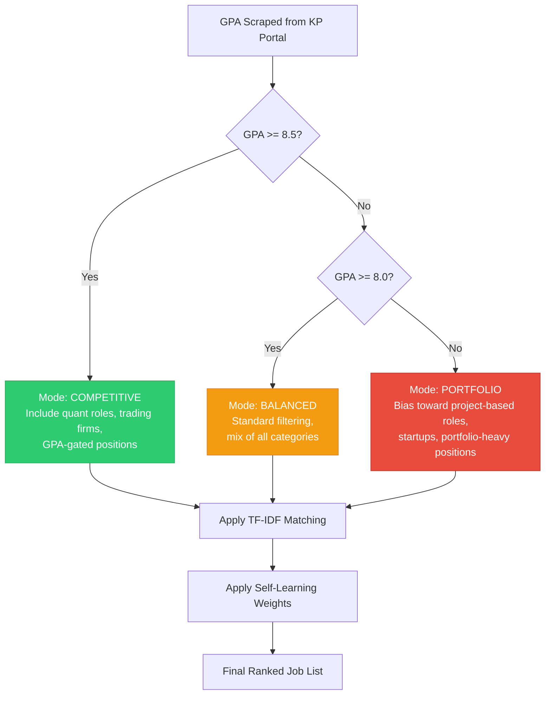

# Atlas — 24-Hour Hackathon Implementation Plan

> **One platform that scrapes your college portal, calculates your attendance risk, finds you internships you're actually qualified for, and learns from your feedback — all delivered to Discord.**

---

## Table of Contents

1. [Architecture Overview](#architecture-overview)
2. [Tech Stack](#tech-stack)
3. [Team Division — 3-Person Parallel Workflow](#team-division)
4. [Shared Contracts & Data Schemas](#shared-contracts)
5. [Hour-by-Hour Timeline (All 3 Members)](#hour-by-hour-timeline)
6. [Module Specifications](#module-specifications)
7. [Integration Protocol](#integration-protocol)
8. [Self-Learning Feedback Loop](#self-learning-feedback-loop)
9. [Verification Plan](#verification-plan)
10. [Demo Strategy](#demo-strategy)

---

## Architecture Overview

```mermaid
graph TB
    subgraph "Aaron — Portal Engine"
        A1["WebCMD Adapter<br/>(Headless Browser)"]
        A2["KP Portal Scraper<br/>(Login, Session, Navigate)"]
        A3["Attendance Extractor<br/>(P, T values → JSON)"]
        A4["Attendance Calculus<br/>(Floor/Ceiling Math)"]
        A5["GPA Extractor"]
    end

    subgraph "Sapna — Intelligence Layer"
        B1["LaTeX Resume Parser"]
        B2["Job Board Scrapers<br/>(Internshala, SimplyHired)"]
        B3["Housing Scraper<br/>(NoBroker / 99acres)"]
        B4["TF-IDF Matcher<br/>(scikit-learn)"]
        B5["GPA-Gated Filter"]
    end

    subgraph "Jeremy — Delivery & Learning"
        C1["Discord Webhook<br/>(Rich Embeds)"]
        C2["Discord Bot<br/>(Reaction Listener)"]
        C3["SQLite Ledger<br/>(Preferences DB)"]
        C4["Self-Learning Engine<br/>(Weight Updates)"]
        C5["Orchestrator<br/>(Main Pipeline)"]
    end

    A3 -->|"attendance.json"| C5
    A4 -->|"risk_report.json"| C5
    A5 -->|"gpa.json"| C5
    B1 -->|"resume_profile.json"| B4
    B2 -->|"jobs_raw.json"| B4
    B3 -->|"housing_raw.json"| C5
    B4 -->|"matched_jobs.json"| B5
    B5 -->|"filtered_jobs.json"| C5
    C5 -->|"digest payload"| C1
    C2 -->|"reactions"| C4
    C4 -->|"updated weights"| C3
    C3 -->|"preference weights"| B5
    A5 -->|"GPA signal"| B5

    style A1 fill:#1a1a2e,stroke:#e94560,color:#fff
    style A2 fill:#1a1a2e,stroke:#e94560,color:#fff
    style A3 fill:#1a1a2e,stroke:#e94560,color:#fff
    style A4 fill:#1a1a2e,stroke:#e94560,color:#fff
    style A5 fill:#1a1a2e,stroke:#e94560,color:#fff
    style B1 fill:#16213e,stroke:#0f3460,color:#fff
    style B2 fill:#16213e,stroke:#0f3460,color:#fff
    style B3 fill:#16213e,stroke:#0f3460,color:#fff
    style B4 fill:#16213e,stroke:#0f3460,color:#fff
    style B5 fill:#16213e,stroke:#0f3460,color:#fff
    style C1 fill:#0f3460,stroke:#533483,color:#fff
    style C2 fill:#0f3460,stroke:#533483,color:#fff
    style C3 fill:#0f3460,stroke:#533483,color:#fff
    style C4 fill:#0f3460,stroke:#533483,color:#fff
    style C5 fill:#0f3460,stroke:#533483,color:#fff
```



---

## Tech Stack

| Layer | Technology | Why |
|-------|-----------|-----|
| **Browser Automation** | WebCMD (`@agentrhq/webcmd`) — headless Chromium | Required — bypasses KP portal's JS-heavy UI. Deterministic CLI adapters reduce token use by 90% vs. raw DOM scraping |
| **Language** | Python 3.10+ | Fast prototyping, rich ecosystem |
| **NLP/Matching** | scikit-learn (TF-IDF + cosine similarity) | No GPU needed, works locally, <1ms per match, fully explainable |
| **Database** | SQLite3 (stdlib) | Zero setup, file-based, perfect for hackathon |
| **Web Delivery** | FastAPI + uvicorn + vanilla JS | Single Python stack, no Node build step. Dashboard reads `data/*.json`; reaction buttons drive the learning loop via `POST /api/feedback`. Optional Discord webhook bonus (`delivery/notify_discord.py`). |
| **Resume Parsing** | `pylatexenc` + `TexSoup` + regex fallback | Multi-engine: pylatexenc for TF-IDF text, TexSoup for section extraction |
| **Job Scraping** | `curl_cffi` + `BeautifulSoup4` | curl_cffi mimics Chrome TLS fingerprint (bypasses Cloudflare on Internshala) |
| **Housing Scraping** | `requests` (NoBroker REST API) | NoBroker has an internal JSON API — no HTML parsing needed |
| **Config** | `python-dotenv` + `config.yaml` | Secrets in .env, settings in YAML |
| **Version Control** | Git + feature branches | 3 people need clean merge strategy |

### WebCMD Setup (Prerequisite — Hour 0)

```bash
# Requires Node.js 20.6+
npm install -g @agentrhq/webcmd

# Verify installation
webcmd doctor

# Create a session for the kp_student profile (saves cookies/session across runs)
# NOTE: --profile is a ROOT flag — session create has no --profile option
webcmd --profile kp_student session create -f json
```

### Python Dependencies (`requirements.txt`)

```
# Core
python-dotenv>=1.0.0
pyyaml>=6.0

# Scraping
requests>=2.31.0
curl_cffi>=0.7.0
beautifulsoup4>=4.12.0

# NLP / Matching
scikit-learn>=1.3.0
numpy>=1.24.0

# Resume Parsing
pylatexenc>=2.10
TexSoup>=0.3.1

# Web Delivery
fastapi>=0.110.0
uvicorn>=0.29.0

# Database (stdlib — no install needed)
# sqlite3
```

---

## Team Division — 3-Person Parallel Workflow {#team-division}

### Aaron — "The Portal Engineer"
**Focus**: WebCMD adapter, KP portal scraping, attendance math, GPA extraction

| Responsibility | Output File | Consumed By |
|---------------|-------------|-------------|
| WebCMD browser setup & login | `webcmd_adapter.py` | Internal |
| KP portal navigation & session handling | `kp_scraper.py` | Internal |
| Attendance data extraction (P, T values) | `data/attendance.json` | Orchestrator (Jeremy) |
| Attendance calculus (floor/ceiling math) | `data/risk_report.json` | Orchestrator (Jeremy) |
| GPA extraction | `data/gpa.json` | GPA-Gated Filter (Sapna) & Orchestrator |

### Sapna — "The Intelligence Architect"
**Focus**: Resume parsing, job scraping, housing scraping, TF-IDF matching, GPA-gated filtering

| Responsibility | Output File | Consumed By |
|---------------|-------------|-------------|
| LaTeX resume parser | `resume_parser.py` | TF-IDF Matcher |
| Job board scrapers (Internshala, SimplyHired) | `data/jobs_raw.json` | TF-IDF Matcher |
| Housing scraper (NoBroker/99acres) | `data/housing_raw.json` | Orchestrator (Jeremy) |
| TF-IDF matching engine | `matcher.py` | GPA-Gated Filter |
| GPA-gated filter (reads GPA from Aaron's output) | `data/filtered_jobs.json` | Orchestrator (Jeremy) |

### Jeremy — "The Integration Commander"
**Focus**: Web delivery (FastAPI dashboard), feedback loop, SQLite ledger, main orchestrator pipeline

| Responsibility | Output File | Consumed By |
|---------------|-------------|-------------|
| FastAPI web dashboard (digest + feedback buttons) | `web/app.py`, `web/static/` | User (browser) |
| SQLite ledger (preferences, history) | `atlas.db` | GPA-Gated Filter, Orchestrator |
| Self-learning weight update engine | `learning_engine.py` | SQLite Ledger |
| Main orchestrator pipeline | `orchestrator.py` | Everything |
| Optional Discord webhook bonus | `notify_discord.py` | Orchestrator (if enabled) |
| Project scaffolding, CI, shared config | `config.py`, `requirements.txt` | Everyone |

---

## Shared Contracts & Data Schemas {#shared-contracts}

> [!IMPORTANT]
> **All three team members MUST agree on these JSON schemas before writing any code.** These are the interfaces between your modules. If the schema changes, notify the team immediately.

### Contract 1: `attendance.json` (Aaron → Jeremy)

```json
{
  "student_name": "Rahul Kumar",
  "student_id": "22BCE1234",
  "semester": "Fall 2026",
  "scraped_at": "2026-08-22T10:00:00+05:30",
  "subjects": [
    {
      "code": "EEE1001",
      "name": "Basic Electrical Engineering",
      "classes_present": 42,
      "classes_total": 52,
      "attendance_pct": 80.77,
      "status": "WARNING"
    }
  ]
}
```

### Contract 2: `risk_report.json` (Aaron → Jeremy)

```json
{
  "generated_at": "2026-08-22T10:00:00+05:30",
  "threshold_pct": 85.0,
  "subjects": [
    {
      "code": "EEE1001",
      "name": "Basic Electrical Engineering",
      "current_pct": 80.77,
      "classes_present": 42,
      "classes_total": 52,
      "classes_can_skip": 0,
      "classes_must_attend": 3,
      "projection": "Must attend next 3 consecutive classes to reach 85%",
      "risk_level": "HIGH"
    }
  ]
}
```

**Attendance Calculus Formula:**
- To find **classes you can skip** while staying above threshold $\theta$:
  $$\text{can\_skip} = \left\lfloor \frac{P - \theta \cdot T}{\theta} \right\rfloor \quad \text{(if positive, else 0)}$$
  where $P$ = classes present (as fraction of total that gives current%), $T$ = total classes.
  
  More precisely: Let current present = $p$, total = $t$. We want $(p) / (t + k) \geq \theta$ where $k$ = future classes skipped. Solving: $k \leq (p - \theta t) / \theta$. So $\text{can\_skip} = \lfloor (p - \theta t) / \theta \rfloor$ if positive.

- To find **classes you must attend** consecutively to reach threshold:
  $$\text{must\_attend} = \left\lceil \frac{\theta \cdot T - P}{1 - \theta} \right\rceil$$
  More precisely: We need $(p + m) / (t + m) \geq \theta$. Solving: $m \geq (\theta t - p) / (1 - \theta)$. So $\text{must\_attend} = \lceil (\theta t - p) / (1 - \theta) \rceil$.

### Contract 3: `gpa.json` (Aaron → Sapna & Jeremy)

```json
{
  "student_id": "22BCE1234",
  "current_cgpa": 8.45,
  "semester_gpa": 8.72,
  "scraped_at": "2026-08-22T10:00:00+05:30",
  "gpa_trend": "stable"
}
```

### Contract 4: `resume_profile.json` (Sapna internal)

```json
{
  "name": "Rahul Kumar",
  "skills": ["Python", "MATLAB", "C", "TensorFlow", "React"],
  "education": "B.Tech Computer Science, VIT Vellore",
  "experience_summary": "Built ML pipeline for image classification...",
  "full_text": "...(entire resume as plain text)...",
  "parsed_at": "2026-08-22T10:00:00+05:30"
}
```

### Contract 5: `jobs_raw.json` (Sapna → Sapna's matcher)

```json
{
  "scraped_at": "2026-08-22T10:00:00+05:30",
  "source": "internshala",
  "jobs": [
    {
      "id": "internshala_12345",
      "title": "Python Developer Intern",
      "company": "TechCorp",
      "location": "Remote",
      "stipend": "₹15,000/month",
      "skills_required": ["Python", "Django", "REST APIs"],
      "description": "Looking for a Python developer intern...",
      "url": "https://internshala.com/internship/detail/12345",
      "posted_date": "2026-08-21",
      "min_gpa": null
    }
  ]
}
```

### Contract 6: `filtered_jobs.json` (Sapna → Jeremy)

```json
{
  "generated_at": "2026-08-22T10:00:00+05:30",
  "student_gpa": 8.45,
  "gpa_mode": "competitive",
  "jobs": [
    {
      "id": "internshala_12345",
      "title": "Python Developer Intern",
      "company": "TechCorp",
      "match_score": 0.87,
      "match_reason": "Skills match: Python, REST APIs. GPA eligible.",
      "stipend": "₹15,000/month",
      "url": "https://internshala.com/internship/detail/12345",
      "category": "engineering"
    }
  ]
}
```

**GPA-Gated Logic:**
- If `cgpa >= 8.5`: mode = `"competitive"` → include quant roles, high-GPA-gated positions
- If `8.0 <= cgpa < 8.5`: mode = `"balanced"` → standard filtering
- If `cgpa < 8.0`: mode = `"portfolio"` → bias toward portfolio-based/project-based roles, deprioritize GPA-gated quant roles
- The user's preference weights from the SQLite ledger also modify the final ranking

### Contract 7: `housing_raw.json` (Sapna → Jeremy)

```json
{
  "scraped_at": "2026-08-22T10:00:00+05:30",
  "source": "nobroker",
  "listings": [
    {
      "id": "nb_98765",
      "title": "2BHK near VIT Campus",
      "price": "₹12,000/month",
      "location": "Katpadi, Vellore",
      "url": "https://nobroker.in/property/98765",
      "bedrooms": 2,
      "furnished": "Semi-Furnished"
    }
  ]
}
```

### Contract 8: `preferences.db` Schema (Jeremy — SQLite)

```sql
-- Tracks user reactions to Discord messages
CREATE TABLE reactions (
    id INTEGER PRIMARY KEY AUTOINCREMENT,
    message_id TEXT NOT NULL,           -- Discord message ID
    item_type TEXT NOT NULL,            -- 'job' | 'housing' | 'attendance'
    item_id TEXT NOT NULL,              -- e.g. 'internshala_12345'
    reaction TEXT NOT NULL,             -- '👍' | '👎' | '⭐' | '🚫'
    reacted_at TIMESTAMP DEFAULT CURRENT_TIMESTAMP
);

-- Aggregated preference weights
CREATE TABLE preference_weights (
    id INTEGER PRIMARY KEY AUTOINCREMENT,
    category TEXT NOT NULL UNIQUE,      -- 'python_jobs', 'remote', 'stipend_high', etc.
    weight REAL DEFAULT 1.0,            -- multiplier (>1 = boost, <1 = suppress)
    updated_at TIMESTAMP DEFAULT CURRENT_TIMESTAMP
);

-- History of all digests sent
CREATE TABLE digest_history (
    id INTEGER PRIMARY KEY AUTOINCREMENT,
    digest_type TEXT NOT NULL,          -- 'attendance' | 'jobs' | 'housing' | 'full'
    payload_json TEXT NOT NULL,
    sent_at TIMESTAMP DEFAULT CURRENT_TIMESTAMP
);
```

---

## Hour-by-Hour Timeline (All 3 Members) {#hour-by-hour-timeline}

> [!NOTE]
> All times are relative. Hour 0 = hackathon start. Integration checkpoints are marked with 🔗.

### Phase 1: Setup & Foundation (Hours 0–1)

| Time | Aaron (Portal) | Sapna (Intelligence) | Jeremy (Integration) |
|------|-------------------|------------------------|----------------------|
| 0:00 | Clone repo, set up branch `portal/main` | Clone repo, set up branch `intel/main` | **Scaffold entire project structure**, create `main` branch, push shared schemas |
| 0:15 | Install WebCMD, test basic browser launch | Install scikit-learn, bs4, requests | Create `config.py`, `.env.example`, `requirements.txt` |
| 0:30 | Get KP portal URL, study login form HTML | Get sample LaTeX resume, study .tex format | Set up SQLite schema, create `database.py` |
| 0:45 | Write WebCMD adapter skeleton | Write resume parser skeleton | Set up SQLite schema, test `database.py` CRUD |
| 1:00 | 🔗 **Checkpoint 1**: Everyone pulls from main, verify project structure works |

**Jeremy's scaffolding creates this structure:**

```
atlas/
├── README.md
├── requirements.txt
├── .env.example                    # KP_USERNAME, KP_PASSWORD, WEBCMD_PROFILE, HOUSING_*, DISCORD_WEBHOOK_URL(optional)
├── .gitignore
├── config.py                       # Loads .env, YAML config
├── config.yaml                     # Thresholds, URLs, scraper settings
├── orchestrator.py                 # Main pipeline (Jeremy)
├── portal/                         # Aaron's domain
│   ├── __init__.py
│   ├── webcmd_adapter.py           # WebCMD browser wrapper
│   ├── kp_scraper.py               # KP portal login + navigation
│   ├── attendance_extractor.py     # Extract P, T values
│   ├── attendance_calculus.py      # Floor/ceiling math
│   └── gpa_extractor.py           # GPA extraction
├── intelligence/                   # Sapna's domain
│   ├── __init__.py
│   ├── resume_parser.py            # LaTeX → plain text → profile JSON
│   ├── job_scraper.py              # Internshala, SimplyHired scrapers
│   ├── housing_scraper.py          # NoBroker/99acres scraper
│   ├── matcher.py                  # TF-IDF + cosine similarity
│   └── gpa_filter.py              # GPA-gated job filtering
├── delivery/                       # Jeremy's domain
│   ├── __init__.py
│   ├── learning_engine.py          # Update preference weights
│   ├── database.py                 # SQLite operations
│   └── notify_discord.py           # OPTIONAL webhook bonus
├── web/                            # Jeremy's domain — web delivery
│   ├── app.py                     # FastAPI dashboard + /api/digest + /api/feedback
│   └── static/                     # index.html, app.js, style.css
├── data/                           # All intermediate JSON files
│   ├── .gitkeep
│   ├── sample_resume.tex           # Test resume
│   └── mock/                       # Mock data for testing before integration
│       ├── attendance.json
│       ├── risk_report.json
│       ├── gpa.json
│       ├── jobs_raw.json
│       ├── filtered_jobs.json
│       └── housing_raw.json
└── tests/
├── test_calculus.py
    ├── test_matcher.py
    ├── test_database.py
    ├── test_learning_engine.py
    └── test_web_api.py
```

### Phase 2: Core Implementation (Hours 1–5)

| Time | Aaron (Portal) | Sapna (Intelligence) | Jeremy (Integration) |
|------|-------------------|------------------------|----------------------|
| 1:00–2:00 | Implement WebCMD login flow: handle captcha, cookies, session tokens | Implement LaTeX resume parser with `pylatexenc` | Create **mock data files** for ALL contracts, so everyone can test independently |
| 2:00–3:00 | Navigate to attendance page, parse HTML table, extract P & T | Build Internshala scraper: search page → job list → extract details | Implement FastAPI `web/app.py`: GET /, /api/digest reading data/*.json |
| 3:00–3:30 | Implement attendance calculus (floor/ceiling formulas) | Build SimplyHired scraper as backup source | Implement dashboard static files: attendance cards, job cards, housing |
| 3:30–4:00 | Navigate to GPA/grades page, extract CGPA and SGPA | Implement TF-IDF matcher: vectorize resume + job descriptions, compute cosine similarity | 🔗 **Checkpoint 2**: Jeremy runs orchestrator with mock data, dashboard shows digest live |
| 4:00–5:00 | Handle edge cases: semester transitions, missing data, login failures | Implement GPA-gated filter logic (competitive/balanced/portfolio modes) | Implement `POST /api/feedback` → learning engine → SQLite |

### Phase 3: Scavengers & Learning (Hours 5–7)

| Time | Aaron (Portal) | Sapna (Intelligence) | Jeremy (Integration) |
|------|-------------------|------------------------|----------------------|
| 5:00–5:30 | Add retry logic and error handling to WebCMD adapter | Build housing scraper (NoBroker or 99acres — whichever is easier) | Implement self-learning engine: map reactions to weight updates |
| 5:30–6:00 | Create `portal/__init__.py` clean API: `get_attendance()`, `get_gpa()` | Create `intelligence/__init__.py` clean API: `get_matched_jobs()`, `get_housing()` | Wire learning engine to SQLite: store reactions, update `preference_weights` |
| 6:00–6:30 | Write unit tests for attendance calculus | Write unit tests for TF-IDF matcher | Write integration to feed preference weights back into Sapna's GPA filter |
| 6:30–7:00 | 🔗 **Checkpoint 3 — MAJOR INTEGRATION**: All three merge to `main`. Test full pipeline with real data |

### Phase 4: Integration & Polish (Hours 7–9)

| Time | Aaron (Portal) | Sapna (Intelligence) | Jeremy (Integration) |
|------|-------------------|------------------------|----------------------|
| 7:00–7:30 | Fix integration bugs from Checkpoint 3 | Fix integration bugs from Checkpoint 3 | Wire all real modules into orchestrator, replace mock data calls |
| 7:30–8:00 | Add GPA trend detection (compare with previous scrape) | Tune TF-IDF: adjust stop words, add skill synonyms | Implement the **GPA→InternRadar feedback loop**: if GPA drops, switch mode |
| 8:00–8:30 | Polish attendance alert messages | Add match score explanations (why this job matched) | Polish dashboard layout + digest sections |
| 8:30–9:00 | End-to-end test: login → scrape → calculus → JSON | End-to-end test: parse resume → scrape jobs → match → filter | 🔗 **Checkpoint 4**: Full end-to-end pipeline test, dashboard with real data |

### Phase 5: Lock & Demo Prep (Hours 9–10)

| Time | Aaron (Portal) | Sapna (Intelligence) | Jeremy (Integration) |
|------|-------------------|------------------------|----------------------|
| 9:00–9:20 | Code freeze. Write `portal/README.md` | Code freeze. Write `intelligence/README.md` | Code freeze. Final merge to `main` |
| 9:20–9:40 | Prepare demo script for KP bypass | Prepare demo data showing match scores | Prepare demo Discord channel, test full pipeline |
| 9:40–10:00 | **Full team rehearsal of demo presentation** | | |

---

## Module Specifications {#module-specifications}

### Module 1: WebCMD Adapter + KP Portal Scraper — Aaron

> [!IMPORTANT]
> **KP Portal Technical Architecture (from research):**
> - **Platform**: Apache Struts (Java) — `kp.christuniversity.in/KnowledgePro`
> - **Login Endpoint**: `StudentLogin.do?method=loginStudent` (POST with `userName` + `password`)
> - **Session**: Java `JSESSIONID` cookie
> - **Attendance Endpoint**: `StudentLogin.do?method=initStudentWiseAttendanceSummary`
> - **⚠️ CRITICAL**: 15-minute account lockout if you don't logout properly (strict single-session concurrency)
> - **Data Format**: Legacy HTML `<table>` with merged cells (`colspan`/`rowspan`)

#### WebCMD Adapter Script (`portal/kp_attendance_adapter.js`)

This is a **deterministic WebCMD adapter** that runs via CLI. Aaron writes this in JavaScript:

```javascript
/**
 * WebCMD Adapter: Knowledge Pro (KP) Portal Attendance Extractor
 * Run: webcmd --profile kp_student --session <session-id> browser run --file kp_attendance_adapter.js
 * NOTE: browser run has no -f flag; the program's return value is the output.
 */
 */
export default async function run({ page, profile }) {
  const KP_BASE_URL = 'https://kp.christuniversity.in/KnowledgePro';
  
  // 1. Navigate to attendance page
  await page.goto(
    `${KP_BASE_URL}/StudentLogin.do?method=initStudentWiseAttendanceSummary`,
    { waitUntil: 'networkidle' }
  );

  // 2. Check if redirected to login (session expired)
  if (page.url().includes('StudentLogin.do') && await page.$('input[name="userName"]')) {
    await page.fill('input[name="userName"]', process.env.KP_USERNAME);
    await page.fill('input[name="password"]', process.env.KP_PASSWORD);
    await page.click('input[type="submit"], button[type="submit"]');
    await page.waitForNavigation({ waitUntil: 'networkidle' });
    
    // Navigate back to attendance summary
    await page.goto(
      `${KP_BASE_URL}/StudentLogin.do?method=initStudentWiseAttendanceSummary`
    );
  }

  // 3. Extract Attendance Table
  const attendanceRecords = await page.evaluate(() => {
    const rows = Array.from(
      document.querySelectorAll('table.attendance-table tr, table tr')
    );
    const data = [];

    for (const row of rows) {
      const cols = Array.from(row.querySelectorAll('td')).map(td => td.innerText.trim());
      if (cols.length >= 5 && cols[0].match(/^[0-9]+|[A-Z]{3,}/)) {
        data.push({
          subjectCode: cols[0],
          subjectName: cols[1],
          classesHeld: parseInt(cols[2], 10) || 0,
          classesAttended: parseInt(cols[3], 10) || 0,
          percentage: parseFloat(cols[4].replace('%', '')) || 0.0,
          status: cols[5] || 'Active'
        });
      }
    }
    return data;
  });

  // 4. CRITICAL: Gracefully logout to avoid 15-minute lockout
  try {
    await page.goto(`${KP_BASE_URL}/StudentLogin.do?method=logout`, { timeout: 5000 });
  } catch (e) {
    // Ignore navigation errors on logout teardown
  }

  return {
    timestamp: new Date().toISOString(),
    recordsCount: attendanceRecords.length,
    attendance: attendanceRecords
  };
}
```

#### Python Wrapper (`portal/webcmd_adapter.py`)

Aaron calls the WebCMD adapter from Python and converts the output to the shared contract format:

```python
"""
WebCMD Python Wrapper — Calls the JS adapter via subprocess, parses JSON output.

Usage:
    adapter = WebCMDAdapter(config)
    attendance_data = adapter.scrape_attendance()  # Returns dict matching attendance.json contract
    gpa_data = adapter.scrape_gpa()                # Returns dict matching gpa.json contract
"""

import subprocess
import json
import os
import shutil
from datetime import datetime

class WebCMDAdapter:
    def __init__(self, config):
        self.profile = config.get('webcmd_profile', 'kp_student')
        self.session_id = config.get('webcmd_session_id', '')  # from `webcmd --profile <name> session create -f json`
        self.adapter_dir = os.path.join(os.path.dirname(__file__), 'adapters')
        
        # Set KP credentials as env vars for the WebCMD subprocess
        os.environ['KP_USERNAME'] = config['kp_username']
        os.environ['KP_PASSWORD'] = config['kp_password']

    def _run_adapter(self, adapter_filename: str) -> dict:
        """Execute a WebCMD adapter script and return parsed JSON."""
        adapter_path = os.path.join(self.adapter_dir, adapter_filename)

        # Windows: npm installs webcmd.cmd — resolve the full path so subprocess
        # can execute it without shell=True.
        webcmd = shutil.which('webcmd')
        if webcmd is None:
            raise RuntimeError("webcmd not found on PATH. Run: npm install -g @agentrhq/webcmd")

        # Raw `browser run` REQUIRES a root --session <id>. NOTE: browser run
        # has no -f flag — the program's return value IS the output.
        cmd = [
            webcmd,
            '--profile', self.profile,
            '--session', self.session_id,
            'browser', 'run',
            '--file', adapter_path
        ]
        
        try:
            result = subprocess.run(
                cmd, capture_output=True, text=True, timeout=60
            )
            if result.returncode != 0:
                raise RuntimeError(f"WebCMD error: {result.stderr}")
            return json.loads(result.stdout)
        except subprocess.TimeoutExpired:
            raise RuntimeError("WebCMD adapter timed out (60s)")
        except json.JSONDecodeError:
            raise RuntimeError(f"Invalid JSON from WebCMD: {result.stdout[:200]}")

    def scrape_attendance(self) -> dict:
        """Scrape attendance and return data matching attendance.json contract."""
        raw = self._run_adapter('kp_attendance_adapter.js')
        
        # Transform WebCMD output to shared contract format
        return {
            "student_name": raw.get('studentName', 'Unknown'),
            "student_id": raw.get('studentId', 'Unknown'),
            "semester": raw.get('semester', 'Current'),
            "scraped_at": raw['timestamp'],
            "subjects": [
                {
                    "code": rec['subjectCode'],
                    "name": rec['subjectName'],
                    "classes_present": rec['classesAttended'],
                    "classes_total": rec['classesHeld'],
                    "attendance_pct": rec['percentage'],
                    "status": "WARNING" if rec['percentage'] < 85 else "OK"
                }
                for rec in raw.get('attendance', [])
            ]
        }

    def scrape_gpa(self) -> dict:
        """Scrape GPA and return data matching gpa.json contract."""
        raw = self._run_adapter('kp_gpa_adapter.js')
        return {
            "student_id": raw.get('studentId', 'Unknown'),
            "current_cgpa": raw.get('cgpa', 0.0),
            "semester_gpa": raw.get('sgpa', 0.0),
            "scraped_at": raw['timestamp'],
            "gpa_trend": "stable"  # Updated by comparing with previous scrape
        }
```

> [!WARNING]
> **Aaron must handle these KP portal edge cases:**
> - **15-minute lockout**: Always logout gracefully in `finally` blocks. If the script crashes mid-session, the student can't log in for 15 minutes.
> - **JSESSIONID expiry**: Detect redirect to login page and re-authenticate automatically.
> - **CAPTCHA on rapid logins**: Add randomized jitter (5-15 min) between scrapes. Don't poll every 60 seconds.
> - **Legacy HTML tables**: Use `colspan`/`rowspan`-aware parsing. Test with multiple semesters.
> - **Portal maintenance**: Cache last successful scrape in `data/` and serve cached data with a staleness warning.

### Module 2: Attendance Calculus (`portal/attendance_calculus.py`) — Aaron

```python
"""
Attendance Calculus Engine.

Given P (present), T (total), and threshold θ (default 85%):

1. classes_can_skip = floor((P - θ*T) / θ)         if P/T > θ, else 0
2. classes_must_attend = ceil((θ*T - P) / (1 - θ))  if P/T < θ, else 0
3. risk_level:
   - "SAFE"     if attendance > 90%
   - "CAUTION"  if 85% <= attendance <= 90%
   - "WARNING"  if 80% <= attendance < 85%
   - "DANGER"   if attendance < 80%
"""

import math
from typing import List, Dict

def calculate_risk(present: int, total: int, threshold: float = 0.85) -> Dict:
    """Calculate attendance risk for a single subject."""
    pct = (present / total) * 100 if total > 0 else 0

    if pct >= threshold * 100:
        can_skip = math.floor((present - threshold * total) / threshold)
        must_attend = 0
    else:
        can_skip = 0
        must_attend = math.ceil((threshold * total - present) / (1 - threshold))

    # Risk level
    if pct >= 90:
        risk = "SAFE"
    elif pct >= 85:
        risk = "CAUTION"
    elif pct >= 80:
        risk = "WARNING"
    else:
        risk = "DANGER"

    return {
        "current_pct": round(pct, 2),
        "classes_present": present,
        "classes_total": total,
        "classes_can_skip": max(0, can_skip),
        "classes_must_attend": max(0, must_attend),
        "risk_level": risk,
        "projection": _build_projection_message(risk, can_skip, must_attend, pct)
    }

def _build_projection_message(risk, can_skip, must_attend, pct):
    if risk == "SAFE":
        return f"You're at {pct}%. You can safely skip {can_skip} more classes."
    elif risk == "CAUTION":
        return f"You're at {pct}%. You can skip {can_skip} class(es) but be careful."
    elif risk == "WARNING":
        return f"⚠️ You're at {pct}%. Must attend next {must_attend} classes to hit 85%."
    else:
        return f"🚨 DANGER: {pct}%. Must attend {must_attend} consecutive classes immediately!"
```

### Module 3: TF-IDF Matcher (`intelligence/matcher.py`) — Sapna

> [!TIP]
> **Key optimizations from research:**
> - Use **trigrams** `ngram_range=(1,3)` to capture multi-word phrases like "machine learning", "REST API", "CI/CD pipeline"
> - Enable **sublinear TF** (`sublinear_tf=True`) to prevent keyword-stuffed job descriptions from dominating
> - **Preserve tech terms**: `C++` → `cpp_lang`, `C#` → `csharp_lang`, `Node.js` → `nodejs` before tokenization
> - Add **custom stop words**: strip recruitment jargon ("responsibilities", "requirements", "candidate")

```python
"""
TF-IDF Job Matching Engine.

Compares resume text against job descriptions using:
1. TF-IDF vectorization with trigrams + sublinear TF (scikit-learn)
2. Cosine similarity scoring
3. Skill keyword boosting with tech-term preservation
4. Preference weight adjustment (from self-learning)

Final score = (cosine_similarity * 0.6) + (skill_overlap * 0.3) + (preference_weight * 0.1)
"""

import re
from sklearn.feature_extraction.text import TfidfVectorizer
from sklearn.metrics.pairwise import cosine_similarity
import numpy as np

# Custom stop words: English defaults + recruitment jargon
CUSTOM_STOP_WORDS = list(TfidfVectorizer(stop_words='english').get_stop_words()) + [
    "job", "role", "responsibilities", "requirements", "candidate",
    "qualification", "qualifications", "preferred", "equal", "opportunity",
    "employer", "work", "working", "experience", "years", "skills"
]

def preprocess_text(text: str) -> str:
    """Normalize text while preserving tech-specific terms like C++, C#, .NET."""
    text = re.sub(r'\bC\+\+\b', 'cpp_lang', text, flags=re.IGNORECASE)
    text = re.sub(r'\bC\#\b', 'csharp_lang', text, flags=re.IGNORECASE)
    text = re.sub(r'\.NET\b', 'dotnet_framework', text, flags=re.IGNORECASE)
    text = re.sub(r'\bNode\.js\b', 'nodejs', text, flags=re.IGNORECASE)
    text = re.sub(r'\bReact\.js\b', 'reactjs', text, flags=re.IGNORECASE)
    text = re.sub(r'[^a-zA-Z0-9_\s]', ' ', text)
    text = re.sub(r'\s+', ' ', text).strip().lower()
    return text

class JobMatcher:
    def __init__(self):
        self.vectorizer = TfidfVectorizer(
            stop_words=CUSTOM_STOP_WORDS,
            max_features=5000,
            ngram_range=(1, 3),       # unigrams + bigrams + trigrams
            sublinear_tf=True,        # 1 + log(TF) — prevents keyword stuffing
            max_df=0.85,              # ignore terms in >85% of docs
            min_df=1
        )

    def match(self, resume_text: str, jobs: list, preference_weights: dict = None) -> list:
        """
        Match resume against job descriptions.
        Returns jobs sorted by match_score (descending).
        """
        if not jobs:
            return []

        # Preprocess all text with tech-term preservation
        clean_resume = preprocess_text(resume_text)
        clean_jobs = [preprocess_text(job['description']) for job in jobs]

        # Build corpus: resume + all job descriptions
        corpus = [clean_resume] + clean_jobs

        # Vectorize
        tfidf_matrix = self.vectorizer.fit_transform(corpus)
        feature_names = np.array(self.vectorizer.get_feature_names_out())

        # Compute cosine similarity of resume (index 0) against all jobs
        resume_vector = tfidf_matrix[0:1]
        job_vectors = tfidf_matrix[1:]
        similarities = cosine_similarity(resume_vector, job_vectors).flatten()

        # Score each job
        results = []
        for i, job in enumerate(jobs):
            cosine_score = similarities[i]
            skill_score = self._skill_overlap(resume_text, job.get('skills_required', []))
            pref_score = self._preference_score(job, preference_weights or {})

            final_score = (cosine_score * 0.6) + (skill_score * 0.3) + (pref_score * 0.1)

            # Extract top matching keywords for explainability
            job_vec = job_vectors[i].toarray()[0]
            resume_arr = resume_vector.toarray()[0]
            overlap_scores = job_vec * resume_arr
            top_indices = np.argsort(overlap_scores)[::-1][:5]
            top_terms = [
                feature_names[idx]
                    .replace('cpp_lang', 'C++')
                    .replace('csharp_lang', 'C#')
                    .replace('dotnet_framework', '.NET')
                    .replace('nodejs', 'Node.js')
                for idx in top_indices if overlap_scores[idx] > 0
            ]

            results.append({
                **job,
                'match_score': round(float(final_score), 4),
                'cosine_similarity': round(float(cosine_score), 4),
                'skill_overlap': round(float(skill_score), 4),
                'matched_keywords': top_terms,
                'match_reason': self._explain_match(job, cosine_score, skill_score, top_terms)
            })

        return sorted(results, key=lambda x: x['match_score'], reverse=True)

    def _skill_overlap(self, resume_text: str, required_skills: list) -> float:
        """Calculate fraction of required skills found in resume."""
        if not required_skills:
            return 0.5  # neutral
        resume_lower = resume_text.lower()
        matched = sum(1 for skill in required_skills if skill.lower() in resume_lower)
        return matched / len(required_skills)

    def _preference_score(self, job: dict, weights: dict) -> float:
        """Apply user preference weights from self-learning."""
        score = 0.5  # neutral baseline
        for key, weight in weights.items():
            if key.lower() in str(job).lower():
                score *= weight
        return min(1.0, max(0.0, score))

    def _explain_match(self, job, cosine, skill_overlap, top_terms):
        reasons = []
        if cosine > 0.3:
            reasons.append("Strong resume-description alignment")
        if skill_overlap > 0.5:
            matched_skills = job.get('skills_required', [])
            reasons.append(f"Skills match: {', '.join(matched_skills[:3])}")
        if top_terms:
            reasons.append(f"Key terms: {', '.join(top_terms[:3])}")
        return ". ".join(reasons) if reasons else "General relevance match"
```

### Module 3b: Job Scraper (`intelligence/job_scraper.py`) — Sapna

> [!TIP]
> **Scraping ease ranking from research:** GitHub Internship Repos (trivial) > ATS APIs like Greenhouse/Lever (easy, clean JSON) > Internshala (easy-medium, use `curl_cffi`) > SimplyHired (easy, RSS feeds) > Indeed/LinkedIn (very hard, avoid)

```python
"""
Job Board Scrapers — Multi-source internship aggregator.

Sources (in priority order):
1. Internshala — Indian internship listings (curl_cffi for Cloudflare bypass)
2. GitHub Internship Repos — Community-curated, zero anti-bot (SimplifyJobs repo)
3. Greenhouse/Lever ATS APIs — Direct JSON, no HTML parsing
"""

from curl_cffi import requests as cffi_requests
from bs4 import BeautifulSoup
import requests
import re

def scrape_internshala(category="computer-science", pages=2):
    """Scrape Internshala internship listings."""
    all_jobs = []
    headers = {
        "User-Agent": "Mozilla/5.0 (Windows NT 10.0; Win64; x64) AppleWebKit/537.36 "
                       "(KHTML, like Gecko) Chrome/124.0.0.0 Safari/537.36"
    }
    
    for page in range(1, pages + 1):
        url = f"https://internshala.com/internships/{category}-internship/page-{page}"
        res = cffi_requests.get(url, headers=headers, impersonate="chrome120")
        soup = BeautifulSoup(res.text, "html.parser")
        cards = soup.find_all("div", class_="individual_internship")
        
        for card in cards:
            title_tag = card.find("h3", class_="job-internship-name")
            company_tag = card.find("p", class_="company-name")
            stipend_tag = card.find("span", class_="stipend")
            link_tag = card.find("a", class_="job-title-href")
            
            if title_tag and company_tag:
                all_jobs.append({
                    "id": f"internshala_{link_tag['href'].split('/')[-1]}" if link_tag else None,
                    "title": title_tag.text.strip(),
                    "company": company_tag.text.strip(),
                    "stipend": stipend_tag.text.strip() if stipend_tag else "Not Disclosed",
                    "url": f"https://internshala.com{link_tag['href']}" if link_tag else "",
                    "source": "internshala"
                })
    return all_jobs

def scrape_github_internships():
    """Scrape curated GitHub internship repo (SimplifyJobs). Zero anti-bot."""
    url = "https://raw.githubusercontent.com/SimplifyJobs/Summer2025-Internships/dev/README.md"
    response = requests.get(url)
    lines = response.text.split("\n")
    postings = []
    
    for line in lines:
        if line.startswith("|") and not line.startswith("| Company") and not line.startswith("| ---"):
            cols = [c.strip() for c in line.split("|")[1:-1]]
            if len(cols) >= 4:
                company = re.sub(r'\[(.+?)\]\(.+?\)', r'\1', cols[0])
                role = cols[1]
                location = cols[2]
                link_match = re.search(r'href="([^"]+)"', cols[3]) or re.search(r'\((https?://[^)]+)\)', cols[3])
                postings.append({
                    "id": f"github_{company.lower().replace(' ', '_')}_{len(postings)}",
                    "title": role, "company": company, "location": location,
                    "url": link_match.group(1) if link_match else "",
                    "source": "github"
                })
    return postings
```

### Module 3c: Housing Scraper (`intelligence/housing_scraper.py`) — Sapna

> [!TIP]
> **NoBroker has an internal REST API** that returns clean JSON — no HTML parsing needed. This is the easiest housing source to scrape.

```python
"""
Housing Scraper — NoBroker REST API.
NoBroker's frontend uses an internal JSON API. We query it directly.
"""

import requests

def scrape_nobroker(city="bangalore", locality="Katpadi", max_budget=25000):
    """Query NoBroker's internal rental search API."""
    url = "https://www.nobroker.in/api/v3/multi/property/filter/rent/filter"
    
    headers = {
        "User-Agent": "Mozilla/5.0 (Windows NT 10.0; Win64; x64) AppleWebKit/537.36",
        "Accept": "application/json, text/plain, */*",
        "Referer": f"https://www.nobroker.in/property/rent/{city}/{locality}/",
    }
    
    params = {
        "pageNo": "1",
        "searchParam": locality,
        "city": city,
        "rent": f"0,{max_budget}",
        "type": "BHK1,BHK2,ROOM",
        "buildingType": "AP,IH",
        "furnishing": "FULLY_FURNISHED,SEMI_FURNISHED"
    }

    try:
        response = requests.get(url, headers=headers, params=params, timeout=10)
        if response.status_code == 200:
            data = response.json()
            properties = data.get("data", [])
            return [{
                "id": f"nb_{item.get('id')}",
                "title": item.get("propertyTitle", "Untitled"),
                "price": f"₹{item.get('rent', 'N/A')}/month",
                "location": item.get("locality", "Unknown"),
                "url": f"https://www.nobroker.in/property/{item.get('id')}",
                "bedrooms": item.get("type", "Unknown"),
                "furnished": item.get("furnishingDesc", "Unknown")
            } for item in properties]
    except Exception as e:
        print(f"NoBroker API error: {e}")
    return []
```

### ~~Module 4: Discord Webhook~~ → REPLACED by Web Dashboard

> [!IMPORTANT]
> **PIVOT (2026-08-22):** Discord webhook delivery is **cancelled**. It is replaced by the FastAPI web dashboard below. The old Discord code below is kept only as reference for the embed color scheme and rate-limit patterns — do NOT build it. The optional `delivery/notify_discord.py` webhook bonus is the only Discord code that may exist.

### Module 4b: Web Dashboard (`web/app.py` + `web/static/`) — Jeremy

> FastAPI + vanilla JS. Single Python stack, no Node build step. Serves the digest from `data/*.json` and turns the emoji-reaction learning loop into button clicks.

```
GET  /                    → static/index.html (dashboard)
GET  /api/digest          → {attendance: [...], jobs: [...], housing: [...], gpa: {...}}
POST /api/feedback        → {item_type, item_id, reaction} → learning_engine.process_reaction()
```

Key mechanics:
- `/api/digest` reads `data/attendance.json`, `data/risk_report.json`, `data/gpa.json`, `data/filtered_jobs.json`, `data/housing_raw.json` fresh on each call. After any pipeline run, a page refresh shows new data — no restart needed.
- Dashboard renders: attendance risk cards (color-coded SAFE/CAUTION/WARNING/DANGER), job cards with 👍👎⭐🚫 buttons, housing listings.
- `POST /api/feedback` maps to `LearningEngine.process_reaction()` (same multipliers, same SQLite). Buttons re-render with a subtle "learned ✓" state.
- Color scheme carries over from the old embed design: SAFE=green(#2ecc71), CAUTION=yellow(#f39c12), WARNING=orange(#e67e22), DANGER=red(#e74c3c), JOB=purple, HOUSING=teal.

```python
"""
Web Dashboard — FastAPI app.
Run: uvicorn web.app:app --reload
"""
from fastapi import FastAPI, Request
from fastapi.responses import FileResponse, JSONResponse
from fastapi.staticfiles import StaticFiles
from pathlib import Path

from delivery.database import Database
from delivery.learning_engine import LearningEngine

app = FastAPI(title="Atlas")
BASE = Path(__file__).parent
DATA = BASE.parent / "data"
db = Database()
engine = LearningEngine(db)

app.mount("/static", StaticFiles(directory=BASE / "static"), name="static")

@app.get("/")
def dashboard() -> FileResponse:
    return FileResponse(BASE / "static" / "index.html")

@app.get("/api/digest")
def digest() -> dict:
    def load(name: str) -> list:
        f = DATA / name
        if not f.exists():
            return []  # graceful empty data — see Anti-Integration-Failure Rules
        import json
        return json.loads(f.read_text())
    return {
        "attendance": load("risk_report.json"),
        "jobs": load("filtered_jobs.json"),
        "housing": load("housing_raw.json"),
        "gpa": load("gpa.json"),
        "weights": db.get_all_weights(),
    }

@app.post("/api/feedback")
async def feedback(request: Request) -> JSONResponse:
    body = await request.json()
    engine.process_reaction(
        message_id=str(body["item_id"]),
        item_type=body["item_type"],
        item_id=body["item_id"],
        reaction=body["reaction"],
    )
    return JSONResponse({"ok": True, "weights": db.get_all_weights()})
```

```python
"""
Discord Webhook Delivery — Rich Embed Messages with Rate Limit Handling.

Builds and sends formatted digest messages to Discord with:
- Attendance alert section (color-coded by risk)
- Matched jobs section (top 5 by score)
- Housing listings section
- Returns message_id for reaction tracking
"""

import requests
import time
from datetime import datetime, timezone

class DiscordWebhook:
    COLORS = {
        "SAFE": 0x2ecc71,      # green
        "CAUTION": 0xf39c12,   # yellow
        "WARNING": 0xe67e22,   # orange
        "DANGER": 0xe74c3c,    # red
        "INFO": 0x3498db,      # blue
        "JOB": 0x9b59b6,       # purple
        "HOUSING": 0x1abc9c    # teal
    }

    def __init__(self, webhook_url):
        self.webhook_url = webhook_url

    def send_digest(self, attendance_risk, matched_jobs, housing, gpa_info):
        """Send the full Atlas digest. Returns message_id for reaction tracking."""
        embeds = []
        embeds.append(self._build_attendance_embed(attendance_risk))
        embeds.append(self._build_gpa_embed(gpa_info))
        for job in matched_jobs[:5]:
            embeds.append(self._build_job_embed(job))
        for listing in housing[:3]:
            embeds.append(self._build_housing_embed(listing))

        payload = {
            "username": "Atlas 🗺️",
            "avatar_url": "https://cdn-icons-png.flaticon.com/512/3233/3233508.png",
            "content": f"**🗺️ Atlas Daily Digest** — {datetime.now().strftime('%B %d, %Y %I:%M %p')}",
            "embeds": embeds[:10]
        }

        # Use ?wait=true to get message ID back for reaction tracking
        target_url = f"{self.webhook_url}?wait=true"
        
        for attempt in range(3):
            response = requests.post(target_url, json=payload)
            if response.status_code == 200:
                return response.json().get("id")  # message_id for reaction tracking
            elif response.status_code == 429:
                retry_after = response.json().get("retry_after", 1.5)
                time.sleep(retry_after)
            else:
                print(f"Webhook error: {response.status_code} - {response.text}")
                break
        return None
```

### Module 5: Self-Learning Engine (`delivery/learning_engine.py`) — Jeremy

> [!IMPORTANT]
> **PIVOT (2026-08-22):** The Discord bot (`on_raw_reaction_add`) is **cancelled**. The **Self-Learning Engine below is unchanged** and remains core — its `process_reaction()` is now called by the web dashboard's `POST /api/feedback` instead of a Discord reaction event. The bot code is kept only as historical reference for the emoji→multiplier mapping.

> [!IMPORTANT]
> **Critical architectural detail (still true):** use raw event handlers (like `on_raw_reaction_add`) when listening to third-party events, NOT cached-state handlers that silently fail. The web equivalent is: stateless POST endpoints reading the request body — never rely on in-memory message cache.

#### Discord Bot (`delivery/discord_bot.py`)

```python
"""
Discord Bot — Reaction Listener for Self-Learning Feedback Loop.

Auto-reacts to webhook messages with feedback emojis.
Listens for user reactions via on_raw_reaction_add (cache-safe).
Forwards reactions to the Learning Engine.
"""

import discord
from discord.ext import commands
import os

# Emoji → action mapping
ACTION_EMOJIS = {
    "👍": "LIKED",
    "👎": "DISLIKED",
    "⭐": "SAVED",
    "🚫": "BLOCKED"
}

intents = discord.Intents.default()
intents.reactions = True
intents.guild_messages = True
intents.message_content = True

bot = commands.Bot(command_prefix="!atlas ", intents=intents)

@bot.event
async def on_ready():
    print(f"🤖 Atlas Bot online as {bot.user} (ID: {bot.user.id})")

@bot.event
async def on_message(message: discord.Message):
    """Auto-react to webhook messages to create 1-click feedback buttons."""
    if message.webhook_id is not None:
        for emoji in ACTION_EMOJIS.keys():
            try:
                await message.add_reaction(emoji)
            except discord.HTTPException:
                pass
    await bot.process_commands(message)

@bot.event
async def on_raw_reaction_add(payload: discord.RawReactionActionEvent):
    """Cache-safe reaction handler. Triggers for ALL reactions, even uncached messages."""
    if payload.user_id == bot.user.id:
        return  # Ignore bot's own reactions

    emoji_name = str(payload.emoji.name)
    if emoji_name not in ACTION_EMOJIS:
        return

    action = ACTION_EMOJIS[emoji_name]
    # Forward to learning engine (imported from learning_engine.py)
    from delivery.learning_engine import LearningEngine
    from delivery.database import Database
    
    db = Database()
    engine = LearningEngine(db)
    engine.process_reaction(
        message_id=str(payload.message_id),
        item_type="digest",  # Will be enriched with actual item type
        item_id=str(payload.message_id),
        reaction=emoji_name
    )
    print(f"📊 Feedback: User {payload.user_id} → {action} on message {payload.message_id}")

if __name__ == "__main__":
    bot.run(os.getenv("DISCORD_BOT_TOKEN"))
```

#### Self-Learning Engine (`delivery/learning_engine.py`)

```python
"""
Self-Learning Engine — Emoji Reaction → Weight Updates.

Reaction mapping:
  👍 = "I like this" → boost category weight by 1.2x
  👎 = "Not relevant" → reduce category weight by 0.8x
  ⭐ = "Save/favorite" → boost by 1.5x
  🚫 = "Never show this" → reduce by 0.3x

Weights are clamped to [0.1, 3.0] to prevent runaway amplification.
Fed back into Sapna's TF-IDF matcher on the next pipeline run.
"""

class LearningEngine:
    REACTION_MULTIPLIERS = {
        '👍': 1.2,
        '👎': 0.8,
        '⭐': 1.5,
        '🚫': 0.3,
    }

    def __init__(self, db):
        self.db = db

    def process_reaction(self, message_id, item_type, item_id, reaction):
        """Process a single reaction and update weights."""
        self.db.log_reaction(message_id, item_type, item_id, reaction)
        categories = self._extract_categories(item_type, item_id)
        multiplier = self.REACTION_MULTIPLIERS.get(reaction, 1.0)
        for category in categories:
            current = self.db.get_weight(category)
            new_weight = max(0.1, min(3.0, current * multiplier))  # clamp
            self.db.update_weight(category, new_weight)

    def _extract_categories(self, item_type, item_id):
        """Extract categories from an item for weight updates."""
        # Lookup item in digest history to get its skills/tags
        item = self.db.get_digest_item(item_id)
        if item:
            return item.get('categories', [item_type])
        return [item_type]

    def get_all_weights(self) -> dict:
        """Get current preference weights for the matcher."""
        return self.db.get_all_weights()
```

---

## Integration Protocol {#integration-protocol}

### Git Workflow

```mermaid
gitgraph
    commit id: "Initial scaffold"
    branch "aaron/portal"
    branch "sapna/intel"
    branch "jeremy/delivery"
    checkout "aaron/portal"
    commit id: "WebCMD adapter"
    commit id: "KP scraper"
    commit id: "Attendance calculus"
    checkout "sapna/intel"
    commit id: "Resume parser"
    commit id: "Job scraper"
    commit id: "TF-IDF matcher"
    checkout "jeremy/delivery"
    commit id: "Discord webhook"
    commit id: "SQLite setup"
    commit id: "Mock data"
    checkout main
    merge "jeremy/delivery" id: "Checkpoint 2"
    checkout "aaron/portal"
    commit id: "GPA extractor"
    checkout "sapna/intel"
    commit id: "Housing scraper"
    commit id: "GPA filter"
    checkout main
    merge "aaron/portal" id: "Checkpoint 3"
    merge "sapna/intel" id: "Merge intel"
    checkout "jeremy/delivery"
    commit id: "Orchestrator wired"
    commit id: "Learning engine"
    checkout main
    merge "jeremy/delivery" id: "Checkpoint 4 - Full integration"
    commit id: "Final polish"
    commit id: "Code freeze 🔒"
```

### Integration Rules

1. **Jeremy creates mock data first** (Hour 0–1). This lets all 3 people test independently.
2. **Never push to `main` directly.** Always merge via pull request or at a checkpoint.
3. **Each person owns their directory.** No cross-directory edits without team agreement.
4. **Shared files** (`config.py`, `requirements.txt`, `data/` schemas) are managed by Jeremy.
5. **If you change a contract schema**, immediately notify the team via Discord/WhatsApp.

### Communication Protocol

| Event | Action |
|-------|--------|
| Schema change | Message team + update `data/mock/` files |
| Blocked on dependency | Use mock data, continue building |
| Module complete | Push to your branch, notify team |
| Checkpoint reached | All three pull from main, test together |
| Bug found in someone else's module | File a GitHub issue, don't fix their code |

---

## Self-Learning Feedback Loop {#self-learning-feedback-loop}

```mermaid
sequenceDiagram
    participant O as Orchestrator
    participant W as Web Dashboard
    participant U as User (browser)
    participant F as POST /api/feedback
    participant L as Learning Engine
    participant DB as SQLite Ledger
    participant M as TF-IDF Matcher

    O->>W: Pipeline writes data/*.json
    W->>U: Dashboard renders digest (jobs, housing, attendance)
    U->>F: Clicks 👍👎⭐🚫 on a card
    F->>L: process_reaction(item_type, item_id, reaction)
L->>DB: Log reaction + update category weights
    Note over DB: python_jobs: 1.2→1.44 (👍👍)<br/>remote: 0.8 (👎)<br/>web_dev: 1.5 (⭐)
    O->>DB: Next run: load updated weights
    O->>M: Pass weights to matcher
    M->>M: Adjust match scores using weights
    Note over M: Python jobs boosted,<br/>web dev roles prioritized,<br/>remote roles suppressed
```



### How Weights Feed Back Into Job Matching

1. **On each pipeline run**, the orchestrator loads `preference_weights` from SQLite
2. These weights are passed to `JobMatcher.match()` as the `preference_weights` parameter
3. The matcher multiplies each job's base score by relevant category weights
4. Over time, the system **learns what the user actually wants** and suppresses irrelevant listings

### GPA → InternRadar Dynamic Adjustment



**Key Insight**: If the portal scrape detects a GPA drop (e.g., from 8.6 to 7.9), the next pipeline run automatically shifts from COMPETITIVE → PORTFOLIO mode, steering the user away from quant/GPA-gated roles they're unlikely to get, and toward engineering/portfolio-based roles where projects matter more than grades.

---

## Verification Plan {#verification-plan}

### Automated Tests

```bash
# Run all tests
python -m pytest tests/ -v

# Individual module tests
python -m pytest tests/test_calculus.py -v    # Aaron: attendance math
python -m pytest tests/test_matcher.py -v     # Sapna: TF-IDF scoring
python -m pytest tests/test_database.py -v    # Jeremy: SQLite
python -m pytest tests/test_learning_engine.py -v  # Jeremy: weight engine
python -m pytest tests/test_web_api.py -v     # Jeremy: dashboard API
```

### Manual Verification

| # | Test | Expected Result | Who |
|---|------|----------------|-----|
| 1 | Run WebCMD login to KP portal | Successfully logs in, extracts attendance table | Aaron |
| 2 | Parse sample LaTeX resume | Extracts all skills, education, experience | Sapna |
| 3 | Start web app: `uvicorn web.app:app --reload` | Dashboard loads, shows mock data | Jeremy |
| 4 | Full pipeline with mock data | `python orchestrator.py --mock` → dashboard shows all sections | Jeremy |
| 5 | Full pipeline with real KP data | Real attendance + real jobs on dashboard | All 3 |
| 6 | Click 👍 on a job card | Weight for that job category increases in SQLite | Jeremy |
| 7 | Refresh dashboard / rerun pipeline | Job ranking reflects updated preferences | Sapna + Jeremy |
| 8 | Simulate GPA drop | Job mode switches from competitive to portfolio | Aaron + Sapna |

---

## Demo Strategy {#demo-strategy}

### The Story: "A Day in the Life of a Stressed Student"

**Duration**: 5-7 minutes

#### Act 1 — The Hook (30 seconds)
> *"How many of you have ever sat in class, anxiously counting on your fingers, trying to figure out if you can skip tomorrow's 8 AM lecture without falling below the attendance threshold? What if I told you there's a system that already knows the answer?"*

#### Act 2 — The KP Bypass (90 seconds)
- Open terminal
- Run `python orchestrator.py --live-demo`
- Show WebCMD launching headlessly, logging into KP portal
- Narrate: *"We're bypassing the clunky KP portal UI entirely. WebCMD is navigating, logging in, and extracting attendance data in real-time..."*
- Show the attendance JSON being generated

#### Act 3 — The Intelligence (60 seconds)
- Show the TF-IDF matching scores
- Explain: *"Our system parsed my LaTeX resume, vectorized it alongside 50+ internship listings, and computed cosine similarity scores. But here's the clever part — it also checked my GPA..."*
- Show the GPA-gated filter in action

#### Act 4 — The Payoff (90 seconds)
- Open the web dashboard in the browser (share screen or projector)
- Show the live Atlas page:
  > **⚠️ EEE Attendance: 80.77%** — Must attend next 3 classes to hit 85%
  >
  > **💼 Top 3 Internships Matching Your Profile:**
  > 1. Python Developer @ TechCorp (87% match) — ₹15K/mo
  > 2. MATLAB Research Intern @ IISc (82% match) — ₹20K/mo
  > 3. C Systems Intern @ Qualcomm (79% match) — ₹25K/mo
  >
  > **🏠 New Listing**: 2BHK Semi-Furnished near campus — ₹12K/mo

#### Act 5 — The Learning (60 seconds)
- Click 👍 on the Python job card and 👎 on the MATLAB job card
- Rerun the pipeline (`python orchestrator.py --mock`)
- Refresh the dashboard
- Show how Python jobs moved up and MATLAB jobs moved down
- *"Atlas learns. Every reaction you give makes it smarter. It's not just a scraper — it's a personal AI career advisor."*

#### Act 6 — The Architecture Close (30 seconds)
- Flash the architecture diagram
- Emphasize: *"Three people, ten hours, zero cloud costs. Everything runs locally. Your data never leaves your machine."*

---

## Open Questions

> [!IMPORTANT]
> **Q1: What is the exact URL of your KP (Knowledge Pro) portal?** Aaron needs this to study the login form HTML structure and build the WebCMD adapter.

> [!IMPORTANT]
> **Q2: Do you have a sample LaTeX resume (.tex file) ready?** Sapna needs this to build and test the resume parser. If not, we should create a template.

> [!IMPORTANT]
> **Q3: (RESOLVED — pivot) A Discord server is no longer required.** Delivery is a local FastAPI web dashboard. The optional Discord webhook bonus only needs `DISCORD_WEBHOOK_URL` in `.env` if Jeremy chooses to add it.

> [!WARNING]
> **Q4: Does the KP portal have any CAPTCHA or 2FA on login?** This significantly affects Aaron's implementation complexity. If there's a CAPTCHA, we may need to either solve it programmatically or use a session cookie approach.

> [!NOTE]
> **Q5: Which city/campus are you at?** This affects the housing scraper's search parameters (NoBroker location, 99acres city filter).

> [!NOTE]
> **Q6: Do you want to target specific job boards?** The plan uses Internshala + SimplyHired. If you prefer other boards (LinkedIn, Wellfound, Naukri), we can adjust Sapna's scrapers.

> [!NOTE]
> **Q7: (RESOLVED) WebCMD is confirmed:** the npm package `@agentrhq/webcmd` (verified installed v0.7.4 here). CLI corrections documented in HANDOFF §A2.3 NOTE.

---

## Proposed Changes

### [NEW] Project Scaffold

#### [NEW] [requirements.txt](file:///c:/Users/cloud/OneDrive/Desktop/Hybrid_Second_Brain/03_Active_Projects/websites/atlas/requirements.txt)
All Python dependencies for the project.

#### [NEW] [config.py](file:///c:/Users/cloud/OneDrive/Desktop/Hybrid_Second_Brain/03_Active_Projects/websites/atlas/config.py)
Central configuration loader (.env + YAML).

#### [NEW] [config.yaml](file:///c:/Users/cloud/OneDrive/Desktop/Hybrid_Second_Brain/03_Active_Projects/websites/atlas/config.yaml)
Scraper settings, thresholds, URLs.

#### [NEW] [orchestrator.py](file:///c:/Users/cloud/OneDrive/Desktop/Hybrid_Second_Brain/03_Active_Projects/websites/atlas/orchestrator.py)
Main pipeline that ties all modules together.

---

### Portal Engine (Aaron)

#### [NEW] [webcmd_adapter.py](file:///c:/Users/cloud/OneDrive/Desktop/Hybrid_Second_Brain/03_Active_Projects/websites/atlas/portal/webcmd_adapter.py)
WebCMD headless browser wrapper for KP portal automation.

#### [NEW] [kp_scraper.py](file:///c:/Users/cloud/OneDrive/Desktop/Hybrid_Second_Brain/03_Active_Projects/websites/atlas/portal/kp_scraper.py)
Login flow, session management, page navigation.

#### [NEW] [attendance_extractor.py](file:///c:/Users/cloud/OneDrive/Desktop/Hybrid_Second_Brain/03_Active_Projects/websites/atlas/portal/attendance_extractor.py)
HTML table parser for attendance P, T values.

#### [NEW] [attendance_calculus.py](file:///c:/Users/cloud/OneDrive/Desktop/Hybrid_Second_Brain/03_Active_Projects/websites/atlas/portal/attendance_calculus.py)
Floor/ceiling attendance math engine.

#### [NEW] [gpa_extractor.py](file:///c:/Users/cloud/OneDrive/Desktop/Hybrid_Second_Brain/03_Active_Projects/websites/atlas/portal/gpa_extractor.py)
CGPA/SGPA extraction from grades page.

---

### Intelligence Layer (Sapna)

#### [NEW] [resume_parser.py](file:///c:/Users/cloud/OneDrive/Desktop/Hybrid_Second_Brain/03_Active_Projects/websites/atlas/intelligence/resume_parser.py)
LaTeX .tex file → plain text → structured profile JSON.

#### [NEW] [job_scraper.py](file:///c:/Users/cloud/OneDrive/Desktop/Hybrid_Second_Brain/03_Active_Projects/websites/atlas/intelligence/job_scraper.py)
Internshala + SimplyHired scrapers.

#### [NEW] [housing_scraper.py](file:///c:/Users/cloud/OneDrive/Desktop/Hybrid_Second_Brain/03_Active_Projects/websites/atlas/intelligence/housing_scraper.py)
NoBroker / 99acres listing scraper.

#### [NEW] [matcher.py](file:///c:/Users/cloud/OneDrive/Desktop/Hybrid_Second_Brain/03_Active_Projects/websites/atlas/intelligence/matcher.py)
TF-IDF vectorization + cosine similarity job matching.

#### [NEW] [gpa_filter.py](file:///c:/Users/cloud/OneDrive/Desktop/Hybrid_Second_Brain/03_Active_Projects/websites/atlas/intelligence/gpa_filter.py)
GPA-gated filtering with competitive/balanced/portfolio modes.

---

### Delivery & Learning (Jeremy)

#### [NEW] [web/app.py](file:///c:/Users/cloud/OneDrive/Desktop/Hybrid_Second_Brain/03_Active_Projects/websites/atlas/web/app.py)
FastAPI dashboard: GET /, GET /api/digest, POST /api/feedback.

#### [NEW] [web/static/index.html](file:///c:/Users/cloud/OneDrive/Desktop/Hybrid_Second_Brain/03_Active_Projects/websites/atlas/web/static/index.html)
Dashboard page — attendance risk cards, job cards with reaction buttons, housing.

#### [NEW] [web/static/app.js](file:///c:/Users/cloud/OneDrive/Desktop/Hybrid_Second_Brain/03_Active_Projects/websites/atlas/web/static/app.js)
Fetches /api/digest, renders cards, POSTs feedback.

#### [NEW] [web/static/style.css](file:///c:/Users/cloud/OneDrive/Desktop/Hybrid_Second_Brain/03_Active_Projects/websites/atlas/web/static/style.css)
Dashboard styles (SAFE/CAUTION/WARNING/DANGER color coding).

#### [NEW] [delivery/learning_engine.py](file:///c:/Users/cloud/OneDrive/Desktop/Hybrid_Second_Brain/03_Active_Projects/websites/atlas/delivery/learning_engine.py)
Emoji/button reaction → weight update engine.

#### [NEW] [delivery/database.py](file:///c:/Users/cloud/OneDrive/Desktop/Hybrid_Second_Brain/03_Active_Projects/websites/atlas/delivery/database.py)
SQLite operations for preferences, reactions, history.

#### [OPTIONAL] [delivery/notify_discord.py](file:///c:/Users/cloud/OneDrive/Desktop/Hybrid_Second_Brain/03_Active_Projects/websites/atlas/delivery/notify_discord.py)
Bonus: one-shot webhook notifier, only fires if DISCORD_WEBHOOK_URL is set.

